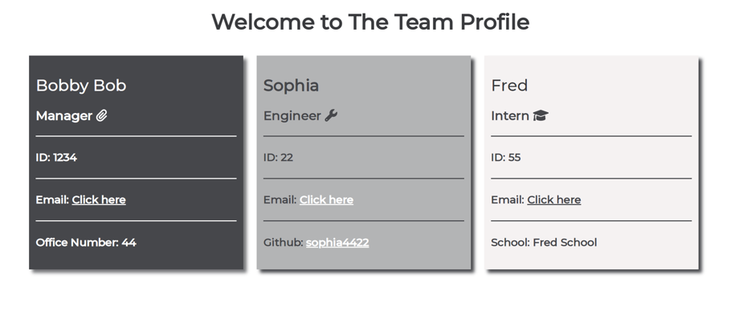
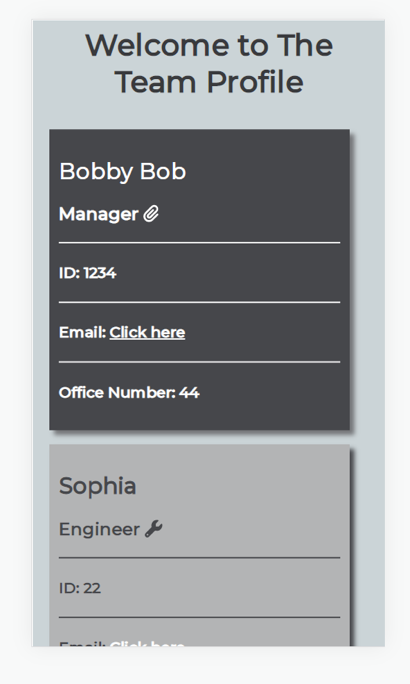

# Team Profile Generator 

## Table of Contents

- [Description](#description)
- [Installation](#installation)
- [Demo](#demo)
- [License](#license)
- [Screenshots](#screenshots)
- [Usage](#usage)
- [Questions](#questions)

## Description

This app allows a user to enter employee details to generate a team roster. The user can select to add a manager, engineer and/or intern. Each employee's name, email and id will be displayed in a card. The manager's office number, the engineer's Github username and the Intern's school is also displayed in the respective cards.

## Demo

View the demo here: https://drive.google.com/file/d/14HviYRxr6RezUx2NyEt6hIjn4-H6jv4s/view?usp=sharing

## Installation

```
npm install
```

## License

MIT License

# Screenshots

The team profile in browser:


The team profile on mobile:


## Usage

```
npm run start
```

## Questions

If you have any questions, please contact me via email: sophiapwall@yahoo.co.uk
My Github profile is [here](https://github.com/sophia4422)
